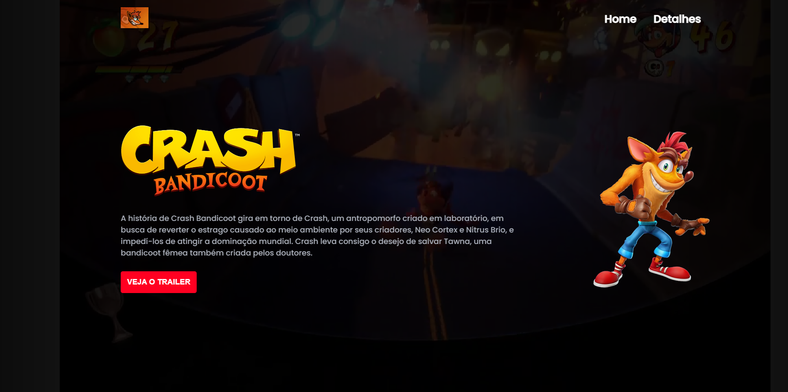
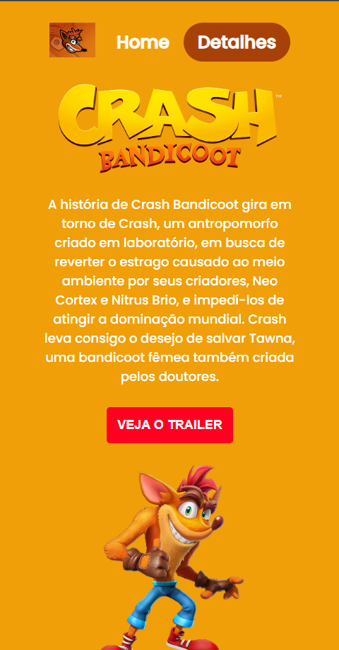

## Projeto Crash

---

## Desafio
Desafio foi criar uma pagina do jogo crash e tem a funcionalidade da janela modal que aparece uma caixa do trailer quando clica

---

## Funcionalidade
[]

## Adaptado ao computador
[]

## Adaptado Mobile
[]

## Tecnologias utilizadas

- HTML
- CSS
- JavaScript